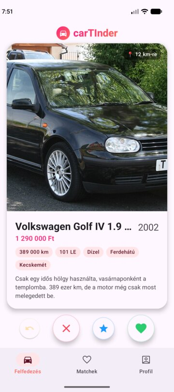

# carTInder 🚗❤️

[](https://github.com/trinyo/carTInder/actions/workflows/ci.yml?query=branch%3Adevelop)
[](https://github.com/trinyo/carTInder/actions/workflows/ci.yml?query=branch%3Amain)


Tinder, csak autókkal. Húzd jobbra, ami tetszik, balra, ami nem, és ha az autó (vagyis az eladója) is így gondolja, kezdődhet a chat.

<p>
  
  
  
  
</p>

## Funkciók

- **Swipe:** jobbra = tetszik, balra = nem kell, felfelé = szuper like, és van visszavonás
- **Match és chat:** a demó autók azonnal döntenek és visszaírnak, valódi eladónál az eladó fogadja el a kedvelést
- **Szűrők:** maximum ár, futásteljesítmény, üzemanyag
- **Valódi fotók** a Wikimedia Commonsról, forrásmegjelöléssel
- **Backend:** Ktor szerver fiókokkal, hirdetésekkel, fotófeltöltéssel és chattel ([server/README.md](server/README.md))

## Projekt felépítése

```
app/      Android app (Kotlin, Jetpack Compose, Room, Coil)
server/   Backend (Kotlin, Ktor, Exposed, SQLite/PostgreSQL), külön Gradle build
docs/     Képernyőképek
```

## Futtatás

**Szerver** (a projekt gyökeréből):

```sh
./gradlew -p server run
```

Alapból a `http://localhost:8080` címen indul, és első induláskor létrehozza a 16 demó autót. A beállításokat lásd a [server/README.md](server/README.md)-ben.

**App:** nyisd meg a projektet Android Studióban, és futtasd az `app` konfigurációt, vagy parancssorból:

```sh
./gradlew installDebug
```

## Tesztek

```sh
./gradlew testDebugUnitTest     # app unit tesztek
./gradlew -p server test        # szerver integrációs tesztek
```

A CI minden pull requestnél és a `main`/`develop` ágakra pusholáskor lefuttatja mindkettőt, és csatolja a debug APK-t.

## Fejlesztési folyamat (git flow)

- `main`: kiadott, címkézett verziók (`v1.0.0`, `v1.1.0`, …)
- `develop`: integrációs ág
- `feature/*`: új funkciók, pull requesttel a `develop`-ba
- `release/*`: kiadás előkészítése, merge a `main`-be címkével, majd vissza a `develop`-ba
- `hotfix/*`: sürgős javítás a `main`-ből

## Fotók

A demó autók fotói a [Wikimedia Commonsról](https://commons.wikimedia.org) származnak (CC BY, CC BY-SA vagy közkincs licenccel). A szerző és a licenc minden autónál szerepel a [server/src/main/kotlin/.../Seed.kt](server/src/main/kotlin/hu/zoltanegyhazi/cartinder/server/Seed.kt) fájlban.
